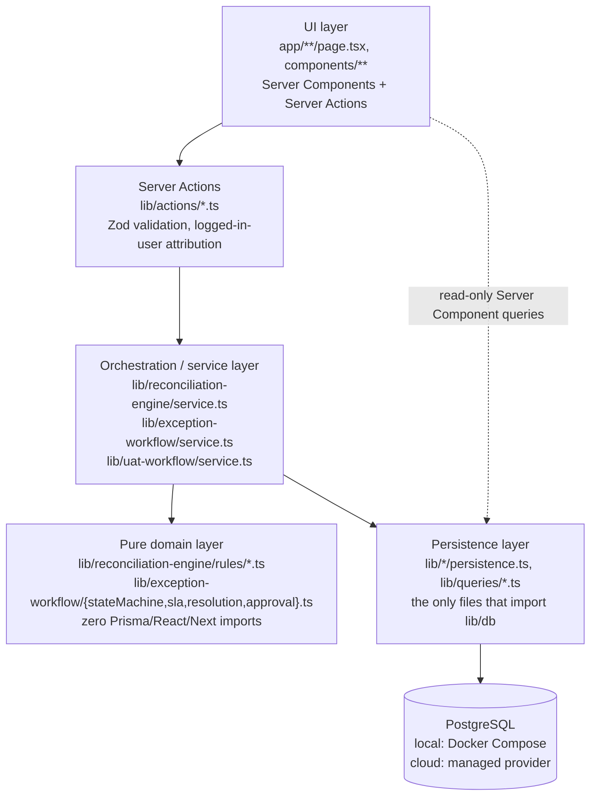

# Architecture

PayGuard IE is a Next.js 16 App Router application with no separate backend service — Server Components read data directly through Prisma, and Server Actions handle every mutation. There is no message queue, no microservice boundary and no external API; everything runs in one Node process against a PostgreSQL database (local via Docker Compose, cloud via a managed Postgres provider — see [LOCAL_POSTGRES_SETUP.md](LOCAL_POSTGRES_SETUP.md)).

## Layering

Every non-trivial feature (the reconciliation engine, the exception workflow) is built in the same four layers, in this dependency direction:

**Why this shape.** The pure domain layer (state machine transitions, SLA calculation, resolution/approval readiness, the seven reconciliation rules) is where the actual business rules live, and it is unit-tested with fixed timestamps and no database — hundreds of test cases run in milliseconds with zero setup. The service layer is the only thing that knows how to compose domain checks with a database transaction; persistence is the only place `prisma` gets imported for writes. UI code never talks to Prisma directly for anything that mutates data — every mutation goes through a named Server Action.

## Request/response shape

There is no client-side state management (no Redux/Zustand/React Query). Reads are Server Components (`app/**/page.tsx`) that call `lib/queries/*.ts` functions directly at render time. Writes are Server Actions invoked from client components via `useTransition` (`lib/hooks/useWorkflowActionState.ts`) — deliberately not the native `useActionState` + `<form action>` binding, which was found to be unreliable against a production build on this stack (see [TESTING_STRATEGY.md](TESTING_STRATEGY.md)). Every mutating Server Action calls `revalidatePath()` for the routes it affects so the next render reflects the change; there is no manual cache invalidation logic anywhere else.

## Two independent "engines," one philosophy

- **Reconciliation engine** (`lib/reconciliation-engine/`): seven pure rules evaluated against every payment, producing stored `ReconciliationResult` rows and idempotent `ExceptionCase` creation. See [../docs/RECONCILIATION_RULES.md](RECONCILIATION_RULES.md).
- **Exception workflow** (`lib/exception-workflow/`): the investigation/resolution/approval lifecycle layered on top of the exceptions the engine creates. See [EXCEPTION_LIFECYCLE.md](EXCEPTION_LIFECYCLE.md).
- **UAT workflow** (`lib/uat-workflow/`): a smaller, sibling service for recording test executions, deliberately never auto-linked to the exception workflow. See [UAT_WORKFLOW.md](UAT_WORKFLOW.md).

All three follow the identical four-layer shape above — once you understand one, you understand all three.

## Identity and authorization: signed sessions plus role checks

Cloud Phase 2.1 added real login: `proxy.ts` (Next.js 16's renamed `middleware.ts` — see its file header) redirects any request without a valid session cookie to `/login`; `lib/actions/auth.ts` verifies a password (`lib/auth/password.ts`, `node:crypto.scrypt`) and issues a signed, stateless session cookie (`lib/auth/session.ts`, HMAC-SHA256, `SESSION_SECRET`). `lib/acting-user.ts` looks up the `User` row for the current session and is what every Server Action attributes its mutation to. Sessions are stateless — revocation only works via `User.isActive`, checked on every request — see [SECURITY_AND_LIMITATIONS.md](SECURITY_AND_LIMITATIONS.md) for that trade-off. Cloud Phase 2.2 added role-based authorization on top: `lib/auth/permissions.ts`'s `requirePermission(actor, permission)` gates every mutating Server Action by the actor's role, right after `getActingUser()` resolves it.

## Persistence: PostgreSQL via a driver adapter

Prisma 7 generates a client into `app/generated/prisma` and is instantiated through `@prisma/adapter-pg` (`lib/db.ts`) rather than Prisma's older binary-engine model — a thin wrapper over `pg`'s connection pool, so it behaves identically against local Docker Postgres and a cloud managed Postgres, no branching by environment. Locally, one Postgres instance (`docker-compose.yml`) hosts three isolated databases — `payguard_dev` for interactive use, `payguard_test` for Playwright, `payguard_vitest` for Vitest integration tests — see [LOCAL_POSTGRES_SETUP.md](LOCAL_POSTGRES_SETUP.md), [DATA_MODEL.md](DATA_MODEL.md) and [TESTING_STRATEGY.md](TESTING_STRATEGY.md).

## Routing map

| Route | Purpose |
| --- | --- |
| `/dashboard` | Live stat tiles across payments, exceptions, UAT and the latest reconciliation run |
| `/payments`, `/payments/[id]` | Payments list (filterable) and detail (settlement, reconciliation results, exceptions, audit timeline) |
| `/settlements` | Settlements list |
| `/reconciliation`, `/reconciliation/[id]` | Trigger and inspect reconciliation runs |
| `/exceptions`, `/exceptions/[id]` | Exception queue (filterable) and the full investigation workspace |
| `/uat`, `/uat/[id]` | UAT queue and test-case execution history |
| `/reports`, `/reports/[type]` (route handler) | Live Markdown/CSV/print-friendly-HTML exports |
| `/settings` | Placeholder — user/role management is explicitly out of scope (no auth exists) |

## What's deliberately not here

No message queue, no background jobs/cron, no external HTTP calls, no file storage service, no multi-tenancy, no real payment rails. These are documented, not accidental — see [SECURITY_AND_LIMITATIONS.md](SECURITY_AND_LIMITATIONS.md) for the full list and reasoning.
